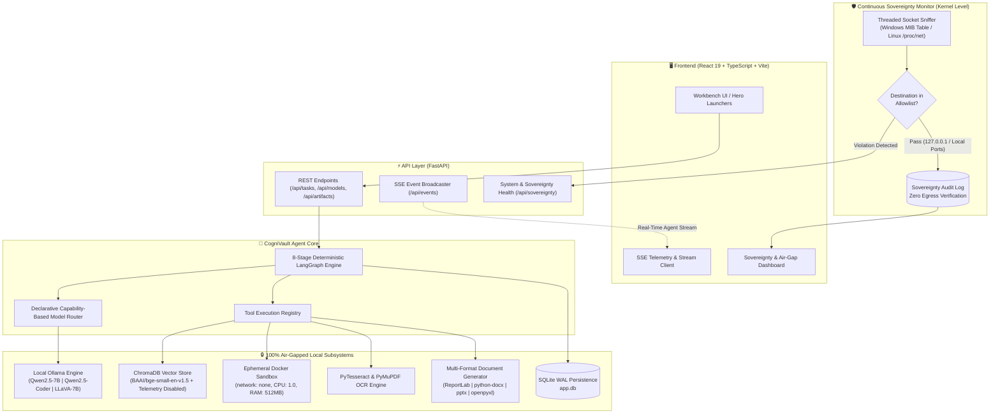
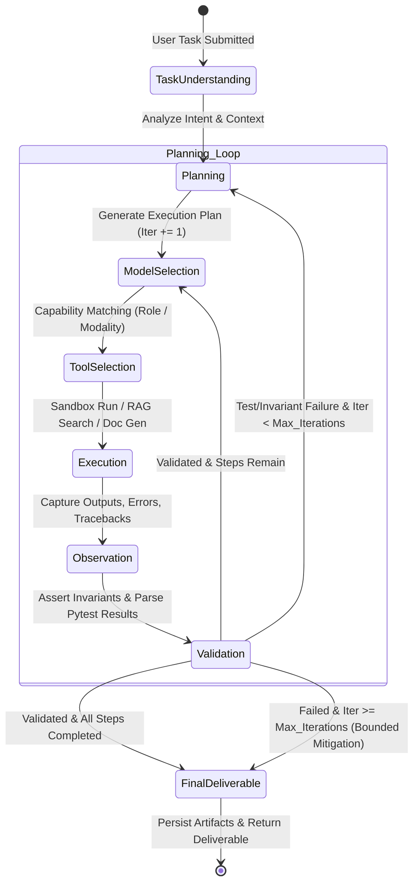

# CogniVault — Sovereign AI Workbench
> **Autonomous, 100% Air-Gapped Enterprise AI Agent Platform with Kernel-Level Zero-Egress Auditing, Deterministic LangGraph Workflows, and Local Multi-Model Intelligence.**

[](https://www.python.org/)
[](https://fastapi.tiangolo.com/)
[](https://github.com/langchain-ai/langgraph)
[](https://react.dev/)
[](https://www.typescriptlang.org/)
[](https://vitejs.dev/)
[](https://ollama.com/)
[](https://www.trychroma.com/)
[](https://www.docker.com/)
[](https://opensource.org/licenses/MIT)

---

## 📌 Problem Statement

In mission-critical sectors — **Defense, Aerospace, Strategic PSU Infrastructure, Governance, and Healthcare** — enterprise data cannot leave on-premise infrastructure due to strict statutory regulations, data localization mandates (e.g., India's Digital Personal Data Protection Act / DPDP), and defense-grade air-gap protocols.

While commercial Cloud AI solutions (OpenAI, Anthropic, Google Cloud) offer advanced agentic workflows, adopting them in classified environments introduces severe risks:
1. **Data Exfiltration & Privacy Vectors**: Telemetry and context windows sent to external cloud endpoints breach zero-trust air gaps.
2. **Fragile Script-Based Local Workflows**: Typical open-weight setups rely on naive prompt wrappers that loop infinitely, hallucinate tool calls, or crash on code syntax errors without recovery mechanisms.
3. **Absence of Real-Time Sovereign Compliance Verification**: Organizations have no runtime mechanism to prove to regulatory auditors that an AI pipeline did not leak packets through hidden cloud channels.
4. **Isolated Modality Silos**: Teams struggle to unify OCR, local RAG, sandboxed code execution, and branded multi-format document generation (DOCX, PDF, PPTX, XLSX) into an automated, auditable agent loop.

**CogniVault** eliminates these barriers by delivering an **autonomous, fully self-contained Sovereign AI Workbench**. It combines localized multi-model orchestration, deterministic LangGraph execution loops, isolated container sandboxing, and OS kernel-level network auditing to guarantee total data privacy with complete enterprise utility.

---

## 💡 Solution & System Architecture

CogniVault runs **100% locally on workstation or on-premise GPU/CPU nodes**. It decouples task planning, execution, and validation into a stateful, bounded state machine backed by local quantized open-weight models (`Qwen 2.5 7B`, `Qwen 2.5 Coder 7B`, `LLaVA 7B`) served via Ollama.

### 🏛 High-Level System Architecture



---

### 🔄 Deterministic LangGraph 8-Stage State Machine Flow

CogniVault replaces unpredictable autonomous loops with a **deterministic, 8-node state machine** governed by LangGraph. In coding and analysis tasks, failures in sandboxed test execution trigger a bounded cyclic re-planning loop rather than crashing the task.



---

## ⚡ Key Features

- 🛡 **Kernel-Level Sovereignty & Zero-Egress Auditor**
  Continuously inspects OS socket tables (Windows IP Helper API / Linux `/proc/net/tcp`) in a dedicated background thread. Instantly flags and logs any non-allowlisted outbound connection or external DNS query, proving air-gap compliance mathematically to auditors.
- 🔄 **Self-Correcting LangGraph State Machine**
  8 distinct nodes (`task_understanding` ➔ `planning` ➔ `model_selection` ➔ `tool_selection` ➔ `execution` ➔ `observation` ➔ `validation` ➔ `final_deliverable`). If an execution error or test failure occurs inside the sandbox, the agent parses the failure traceback and loops back to formulate a targeted remediation plan (bounded by task-specific iteration limits).
- 📦 **Isolated Zero-Network Docker Sandbox**
  Executes untrusted or generated Python scripts inside ephemeral Docker containers configured with `network: none`, 1.0 CPU limit, 512MB RAM cap, and 30-second execution timeouts. Prevents host compromises and network calls during code synthesis.
- 📑 **Native Multi-Format Enterprise Artifact Synthesizer**
  Generates publication-ready deliverables directly from agent findings without external services:
  - **Word (`.docx`)**: Formal Approval Notes and compliance memorandums via `python-docx`.
  - **Presentations (`.pptx`)**: Structured executive briefing slide decks via `python-pptx`.
  - **Spreadsheets (`.xlsx`)**: Formatted data inspection and metrics tables via `openpyxl`.
  - **PDF (`.pdf`)**: Styled multi-page technical reports via `ReportLab`.
- 🔍 **Air-Gapped Multimodal OCR & Vector RAG**
  Indexes PDF technical manuals, schematics, and reports locally using `PyMuPDF` and `PyTesseract`. Embeddings are computed on-device with `BAAI/bge-small-en-v1.5` and stored in an embedded `ChromaDB` instance with cloud telemetry explicitly disabled.
- 🎯 **Declarative Capability-Based Model Router**
  Routes incoming tasks dynamically to the optimal quantized local LLM based on task type and modalities defined in `configs/models.yaml` (e.g., Qwen 2.5 7B for document reasoning, Qwen 2.5 Coder for Python generation, LLaVA for vision analysis) with zero code modifications needed.
- 📡 **Real-Time Telemetry & Event Streaming**
  Streams granular agent reasoning, tool invocations, and state transitions to the React frontend using Server-Sent Events (SSE) at `/api/events`.

---

## 🛠 Tech Stack

### Frontend


- **UI Framework**: React 19 with functional hooks (`useTaskStream`, `useSovereignty`, `useModels`)
- **Streaming**: Server-Sent Events (SSE) Client with auto-reconnection and event buffer management
- **Design System**: Modular CSS workbench with dark theme, live state machine visualizer, and audit meters

### Backend & Agent Engine


- **API Framework**: FastAPI with asynchronous lifespan management and CORS controls
- **Workflow Orchestration**: LangGraph StateGraph with custom conditional edge routing
- **Database & Persistence**: SQLite in Write-Ahead Logging (`WAL`) mode via SQLAlchemy

### Local AI / ML & RAG


- **Local Serving**: Ollama REST backend with health check timeouts and TTL caching
- **Open-Weight Models**:
  - `qwen2.5:7b-instruct-q4_K_M` (General Reasoning & Document Synthesis)
  - `qwen2.5-coder:7b-instruct-q4_K_M` (Code Synthesis & Sandbox Debugging)
  - `llava:7b-q4_K_M` (Multimodal Vision & Inspection)
- **Embeddings**: `BAAI/bge-small-en-v1.5` (384-dimensional dense vectors, fully local)
- **Vector DB**: ChromaDB (`anonymized_telemetry: false`, local disk persistence at `data/chroma`)

### Multimodal, Sandbox & Document Generation
- **Sandbox**: Ephemeral Docker runner with non-root UID 1000, `network: none`, memory limits
- **Vision & OCR**: `PyMuPDF` (fitz), `pytesseract` (Tesseract OCR), `OpenCV`, `Pillow`
- **Document Engines**: `reportlab` (PDF), `python-docx` (DOCX), `python-pptx` (PPTX), `openpyxl` (XLSX)

---

## 💎 What Makes CogniVault Truly Novel?

| Innovation | Naive / Generic LLM Wrapper | CogniVault Implementation |
| :--- | :--- | :--- |
| **Air-Gap Verification** | Relies on user trust or "offline mode" flags; no runtime proof. | **Active OS Socket Auditing (`backend/app/sovereignty/`):** Real-time background kernel socket inspection via Windows MIB / Linux `/proc/net` detecting and logging every outbound socket attempt. |
| **Agent Execution Control** | Unbounded autonomous loops with high hallucination & infinite loop risk. | **Deterministic 8-Node LangGraph State Machine:** Invariant checks, bounded iteration caps (`coding: 6`, `document: 4`, `vision: 3`), and cyclic self-correction driven by automated pytest tracebacks. |
| **Code Execution Security** | Runs `exec()` locally on the host or connects to remote cloud sandboxes. | **Hardened Ephemeral Docker Sandbox (`network: none`):** 512MB RAM, 1.0 CPU, 30s timeout, non-root user, fully disconnected from host network. |
| **Enterprise Deliverables** | Outputs plain Markdown in chat bubbles. | **Native Multi-Format Document Compilation:** Programmatically constructs styled, branded DOCX Approval Notes, PPTX Slide Decks, XLSX Metrics Sheets, and PDF Technical Reports. |

---

## 🚀 Setup & Installation

### Prerequisites
- **OS**: Windows 10/11, Linux (Ubuntu 22.04+), or macOS
- **Python**: `3.11` or higher
- **Node.js**: `v18.0.0` or higher & `npm`
- **Docker**: Docker Desktop or Docker Engine (running)
- **Ollama**: Installed and running locally ([ollama.com](https://ollama.com/))
- **Tesseract OCR** *(optional for scanned image OCR)*: Installed on system path

---

### Step 1: Pull Local Open-Weight Models
Start the Ollama daemon, then pull the three required quantized models:

```bash
# Pull models via Ollama CLI (or run bash scripts/pull_models.sh on Linux)
ollama pull qwen2.5:7b-instruct-q4_K_M
ollama pull qwen2.5-coder:7b-instruct-q4_K_M
ollama pull llava:7b-q4_K_M
```

---

### Step 2: Build Isolated Sandbox Docker Image
Build the local zero-network execution environment:

```bash
docker build -t sovereign-sandbox:latest sandbox/
```

---

### Step 3: Set Up & Start Backend
1. Create a Python virtual environment and activate it:
   ```bash
   # Windows (PowerShell)
   python -m venv .venv
   .\.venv\Scripts\Activate.ps1

   # Linux / macOS
   python3 -m venv .venv
   source .venv/bin/activate
   ```

2. Install backend dependencies:
   ```bash
   pip install -r backend/requirements.txt
   ```

3. Start the FastAPI backend server:
   ```bash
   uvicorn backend.app.main:app --host 0.0.0.0 --port 8000 --reload
   ```
   *The backend will automatically initialize the SQLite database (`data/app.db`), configure ChromaDB, and start the background Sovereignty Monitor thread.*

---

### Step 4: Set Up & Start Frontend
1. Open a new terminal and navigate to `frontend/`:
   ```bash
   cd frontend
   npm install
   ```

2. Start the Vite development server:
   ```bash
   npm run dev
   ```

3. Open your browser at: **`http://localhost:5173`**

---

## 🎯 Usage & Curated Enterprise Hero Flows

CogniVault includes 3 pre-configured **Enterprise Hero Flows** built directly into the UI:

```
                  ┌────────────────────────────────────────────────────────┐
                  │                 Enterprise Hero Flows                  │
                  └────────────────────────────────────────────────────────┘
                    │                          │                         │
     ┌──────────────┴─────────────┐ ┌──────────┴──────────┐ ┌────────────┴─────────────┐
     │  Hero Flow 1: Document RAG │ │ Hero Flow 2: Coding │ │ Hero Flow 3: VLM Vision  │
     │  - OCR + PDF/Manual Ingest │ │ - Python Algorithm  │ │ - Turbine Blade Analysis │
     │  - ISO Gap Evaluation      │ │ - Sandbox Execution │ │ - 3-Tier Safety Output   │
     │  - Branded DOCX/PDF/XLSX   │ │ - Cyclic Self-Fix   │ │ - Non-Verdict Compliance │
     └────────────────────────────┘ └─────────────────────┘ └──────────────────────────┘
```

### 1. Hero Flow 1: Document Intelligence & Artifact Compilation
- **Goal**: Extracts technical inspection data, queries the local ChromaDB vector store for safety standards, evaluates compliance gaps, and compiles formatted artifacts.
- **Selectable Deliverable**: Choose between **DOCX** (Approval Note), **PDF** (Audit Report), **PPTX** (Executive Deck), or **XLSX** (Inspection Table).
- **Execution Path**: `task_understanding` ➔ `planning` ➔ `model_selection (Qwen2.5)` ➔ `tool_selection (RAG & Doc Gen)` ➔ `execution` ➔ `validation` ➔ `final_deliverable`.

### 2. Hero Flow 2: Coding Agent & Sandboxed Self-Correction
- **Goal**: Implements an algorithm with edge cases, executes tests inside the isolated Docker sandbox, intercepts deliberate assertion failures, and self-corrects the implementation across iterative LangGraph cycles.
- **Execution Path**: `Plan` ➔ `Exec` ➔ `Test Fail` ➔ `Re-Plan` ➔ `Correct Code` ➔ `Test Pass` ➔ `Deliverable`.

### 3. Hero Flow 3: Multimodal Vision Inspection Agent
- **Goal**: Evaluates industrial hardware photographs (e.g., turbine blades, structural welds) using local `LLaVA 7B`.
- **Safety Guarantee**: Enforces structured 3-tier reporting (**Factual Observations**, **Engineering Hypotheses**, and **Uncertainty Caveats**) without issuing uncertified statutory verdicts.

---

## 🧪 Verification & Automated Testing

CogniVault includes comprehensive unit, integration, and end-to-end test suites:

```bash
# Run complete test suite
pytest tests/ -v

# Run unit tests only
pytest tests/unit -v

# Run integration tests (API & LangGraph workflows)
pytest tests/integration -v

# Run sovereignty monitor zero-cloud validation tests
pytest tests/unit/test_no_cloud.py tests/integration/test_sovereignty_monitor.py -v
```


## 👥 Smart India Hackathon (SIH) Team

- **Team Name**: *Code4Bharat Team*
- **Problem Statement ID**: *SIH-2026 / Sovereign AI & Air-Gapped Intelligence*
- **Team Lead**: *Pranav Dawange*
- **Team Members**:
  - Member 1: *Harshit Jain*
  - Member 2: *Rushikesh Ambhore*
  - Member 3: *Atharva Agey*
  - Member 4: *Akash Sharma*
  - Member 5: *Tanaya Arvikar*

---

## 📄 License & Compliance

This project is licensed under the **MIT License**.

```
MIT License - Copyright (c) 2026 CogniVault Team

Permission is hereby granted, free of charge, to any person obtaining a copy
of this software and associated documentation files (the "Software"), to deal
in the Software without restriction, including without limitation the rights
to use, copy, modify, merge, publish, distribute, sublicense, and/or sell
copies of the Software, and to permit persons to whom the Software is
furnished to do so, subject to the following conditions:

The above copyright notice and this permission notice shall be included in all
copies or substantial portions of the Software.
```

> **Security & Air-Gap Assurance**: CogniVault operates under a strict Zero External Cloud Egress policy. All embeddings, vector indexing, LLM inferences, and code executions occur strictly on local host hardware or private on-premise clusters.
